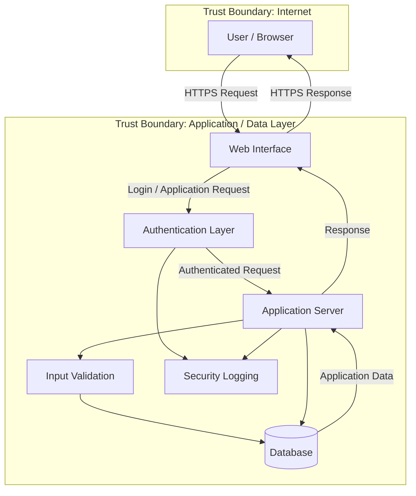

# Application Architecture & Data Flow

## System Architecture

The following diagram represents the application components and primary data flows considered during the threat modeling exercise.

Application Components
1. User / Browser

The user interacts with the application through a web browser. Authentication requests and application requests originate from this component.

2. Web Interface

The web interface receives user requests and displays application responses. It represents the client-facing portion of the application.

3. Authentication Layer

The authentication layer validates user credentials and establishes authenticated sessions.

Security considerations include:

Credential protection
Authentication bypass
Brute-force attempts
Session management
Account enumeration
4. Application Server

The application server processes authenticated requests and performs application business logic.

Security considerations include:

Authorization failures
Injection attacks
Improper input handling
Business logic abuse
Information disclosure
5. Input Validation

Input validation checks data received from users before it is processed or stored.

Security controls include:

Input length restrictions
Expected data validation
Rejection of malformed input
Server-side validation
6. Database

The database stores application data and user-related information.

Security considerations include:

Unauthorized database access
SQL injection
Sensitive data exposure
Excessive database privileges
Data integrity
7. Security Logging

Security events are recorded for monitoring, investigation, and incident response.

Important events include:

Successful authentication
Failed authentication
Authorization failures
Suspicious application activity
Security-relevant errors
Primary Data Flows
Flow	Description	Security Consideration
User → Web Interface	User sends application request	TLS and input validation
Web Interface → Authentication	Login request	Credential protection
Authentication → Application Server	Authenticated request	Session validation
Application Server → Validation	User-controlled input	Server-side validation
Application Server → Database	Data access	Authorization and least privilege
Application Server → Logging	Security event	Log integrity
Application Server → Web Interface	Application response	Information disclosure
Trust Boundaries
Internet Boundary

The user and browser are considered outside the application's trusted environment.

Application / Data Boundary

The web interface, authentication layer, application server, validation layer, database, and logging components form the application's trusted processing environment.

Threat modeling focuses particularly on data crossing these boundaries.

Security Design Considerations

The assessment considers:

Authentication
Authorization
Session management
Input validation
Database security
Data protection
Security logging
Availability
Information disclosure
Threat Modeling Relationship

The architecture is used as the basis for identifying STRIDE threats.

Each data flow and application component is evaluated for possible:

Spoofing
Tampering
Repudiation
Information Disclosure
Denial of Service
Elevation of Privilege
